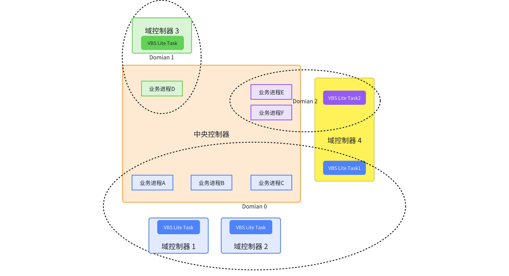
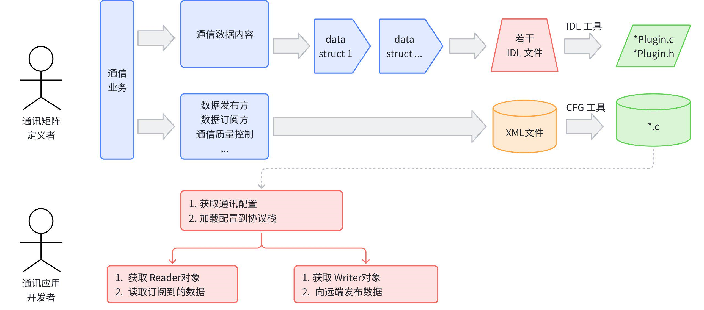
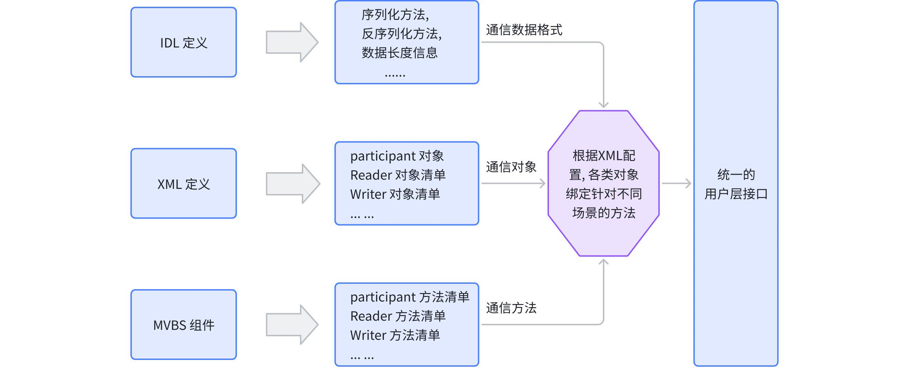

# VBSLite 项目介绍

## 1. 项目简介

随着汽车产业向电动化、智能化、网联化加速转型，车载电子电气架构正经历革命性重构。传统分布式ECU架构已无法满足高速数据传输、跨域协同和软件定义汽车（SDV）的需求，而车载通信总线作为连接整车传感器与控制器的“中枢神经”，其性能与自主可控性直接决定了车企的核心竞争力

星环OS通信总线（VBS，Vehicle Bus System）是理想汽车面向智能汽车领域开发的高效数据交互通信平台。它通过一套标准化的通信协议、模块化架构和实时数据传输能力，为整车电子电气系统提供实时、可靠的信息通道，实现辅助驾驶、动力控制、信息娱乐、主动安全等服务间的无缝协同

VBSLite，也称为MVBS（Micro Vehicle Bus System），是星环OS通信总线的精简版本。它引入了简化的QoS策略，支持自定义子消息，并具备强大的互操作性、容错恢复能力和低资源消耗等特点。VBSLite 可以部署在资源有限的MCU上，为资源受限设备的DDS实现提供了高效的解决方案和最佳实践

## 2. 项目架构

### 2.1. 基本概念

VBSLite通信中间件按自顶向下的方法进行设计

1. 通信网络把不同的组件按 Domian 进行划分。同Domain内的组件可以相互发现并通信；不同Domain内的组件则无法相互发现和通信

2. 通常一个 Task 或者一个进程，就是通信网络中的一个参与者（Participant），在同一个 Domain 中可以包含若干个参与者
3. 在特定的 Domain 中，当其中的各个 Participant 完成相互发现后，它们即可在该 Domain 上发布数据，并订阅其他 Participant 发布的数据
4. Topic 是一个关键概念，用于描述和定义数据的类型和含义。它能够有效地将不同业务发布的数据隔离开来，确保数据的组织和管理更为简洁和高效
5. 在VBSLite中，一个 Topic 的数据发布方被定义为 Writer, 数据的订阅方被定义为 Reader
6. 一个 Participant 可以管理若干个 Reader 和 Writer

### 2.2. 基础框架

#### 2.2.1. 业务视角

从终端用户使用角度来看，大致流程为

**通信矩阵的设计者**：根据业务的需求来定义通信矩阵的每个参与者，每个参与者发布什么数据（Writer），订阅什么数据 ( Reader )，数据格式 ( IDL )，以及通信服务质量( QoS )。这些内容最终会生成一个配置信息，其它开发者可以通过接口获取这些配置信息

**通信应用的开发者**：通过接口获取配置，并将配置加载到协议栈。接下来就可以获取通信矩阵配置产生通信对象（Participant / Writer / Reader），并操作这些通信对象

#### 2.2.2. 技术视角

* IDL文件专门用于定义通信数据的格式， 经过IDL工具会产生 `*Plugin.c`, `*Plugin.h`
* MVBS 组件提供各类对象的操作方法
* XML 就是用户定义通信对象，以及通信控制相关信息，经过 XML 工具转换成 `*.c` 文件。在这个 `*.c` 文件中, 除了会生成各类通信对象清单以外, 还会给每个通信对象赋予操作方法 ：

  * **统一的对外接口**：这些接口提供给通信应用开发者使用。不管通信服务配置(QoS等)如何修改，用户接口无需感知
  * **内部接口**：这部分接口用于协议栈内部使用，可以根据用户配置，绑定上不同的实现方法。比如根据是否需要可靠传输（reliable），采用不同的发送方法

另外, 为了让VBSLite 更容易迁移和移植到其他平台, 定义了用于南向兼容的Adapter层。整个组件分层如下

## 3. 项目技术特性

**支持全域部署**

* VBS采用"协议统一+硬件无关"架构，一套协议实现跨多域控制器内外的深度协同，无需进行多协议间的报文翻译

**通信性能优**

* P99时延≤1ms，支持高可靠业务0丢包

**资源开销小**

* 同样的硬件资源，可部署服务可提升一倍，100KB内存支持部署200+通信服务节点

## 4.开发环境

### 4.1. 支持的操作系统

| **支持的操作系统**                |
| --------------------------------------- |
| HaloOS（理想自研车载操作系统）          |
| Linux（Ubuntu、Fedora等主流发行版）     |
| Windows（Win7及以上）                   |
| 嵌入式Linux（如ARM架构的地平线J6M A核） |

### 4.2. 支持的编译器

|         **支持的编译器**         |
| :------------------------------------: |
|        GCC（Linux/嵌入式Linux）        |
|          Clang（跨平台支持）          |
|     MinGW（Windows下的GNU工具链）     |
|     TASKING（嵌入式/汽车电子领域）     |
| GHS（Green Hills，高可靠性嵌入式系统） |

## 5. 快速入门

* [VBSLite快速入门](./developer-guide/quick_start.md)

## 6. 开发者文档

| **类别** | **文档**                                       |
| :------------: | ---------------------------------------------------- |
|    开发者手册    | [《VBSLite开发者手册》](./developer-guide/user_manual.md) |
|    接口文档    | [《VBSLite接口文档》](./developer-guide/vbslite_api.md) |
