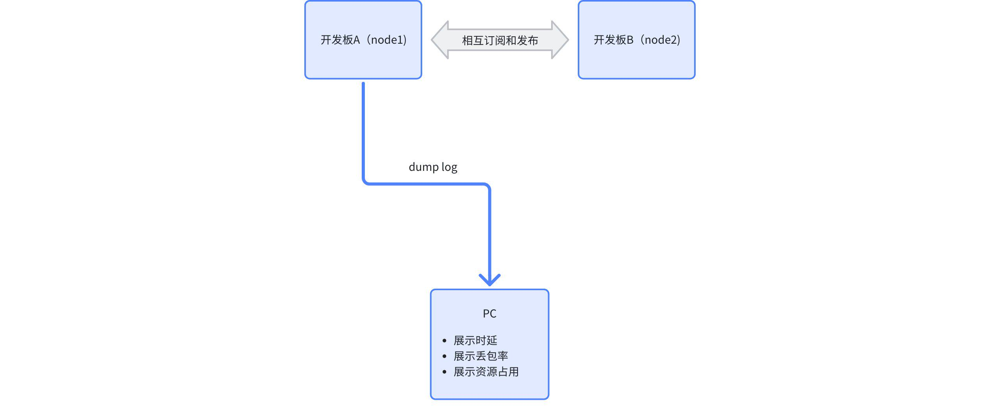
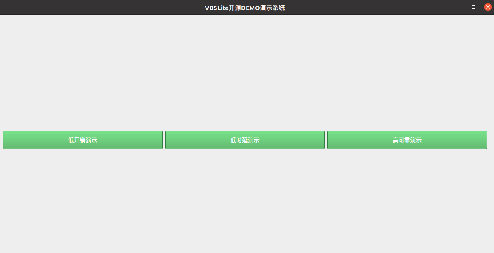
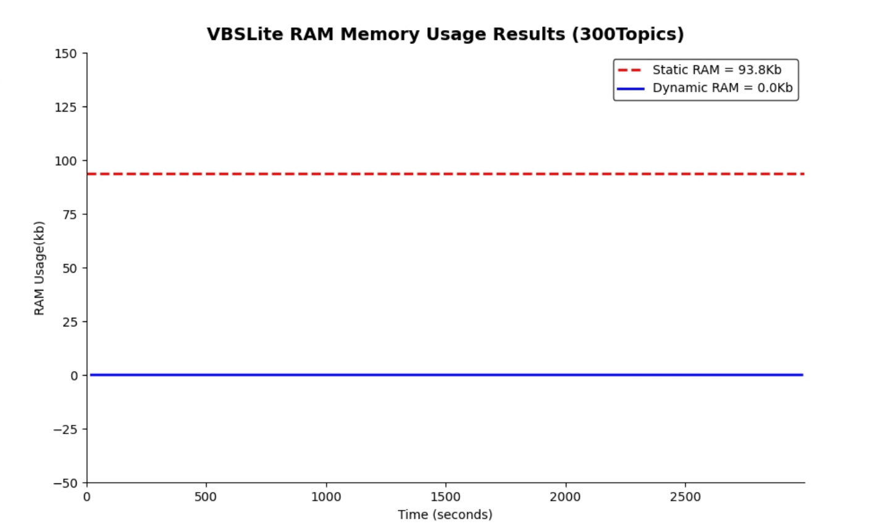
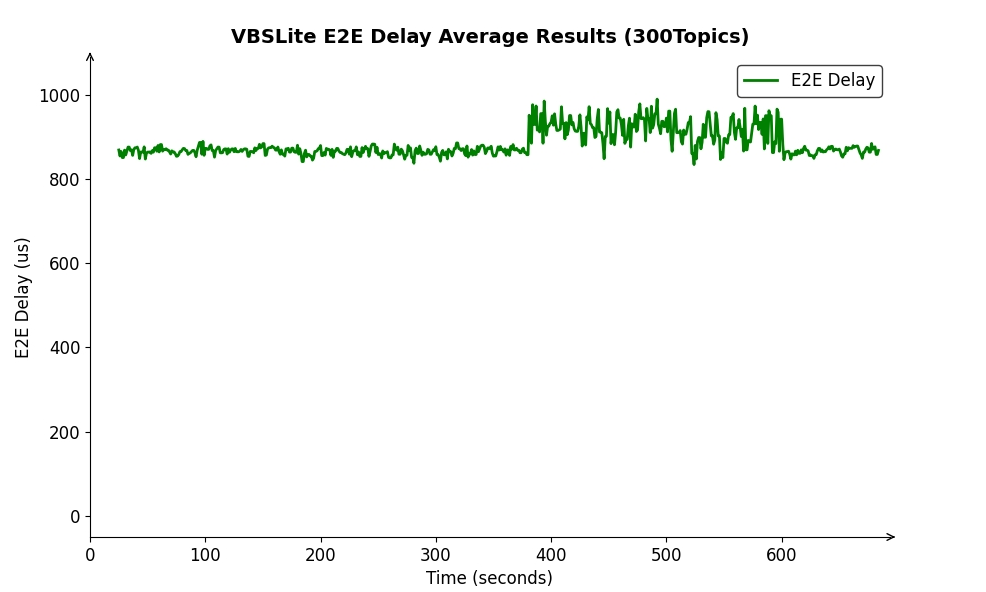
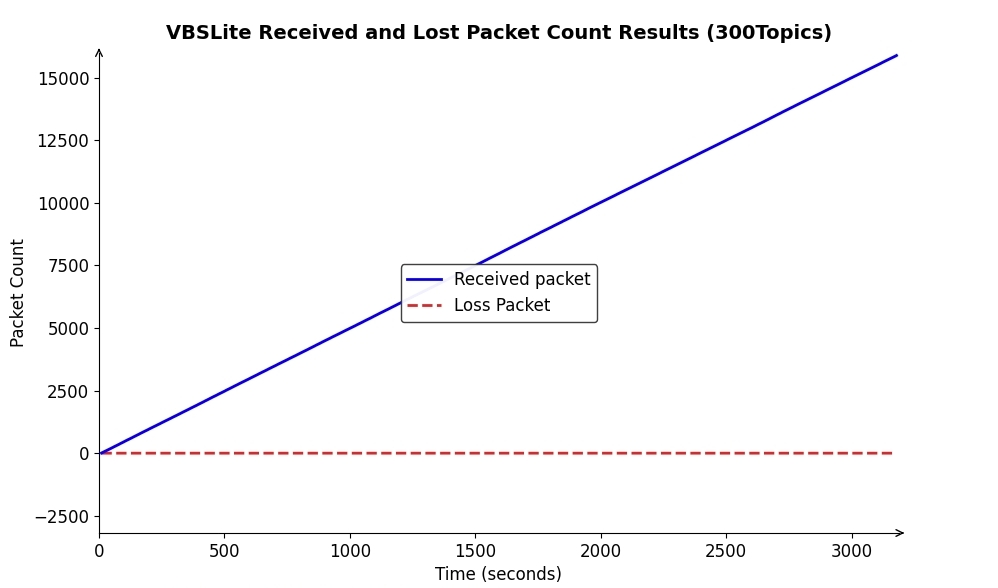

# 车载通信总线轻量化创新实践

## 1. 应用场景

在汽车电子电气架构向中央集中式演进背景下，传统分布式ECU架构的通信面临三重刚性约束：

* 资源枷锁：主流DDS协议栈资源占用较高，导致车规级MCU剩余资源难以支撑快速增长的业务需求
* 实时鸿沟：线控制动系统要求端到端时延≤1ms，而传统SOME/IP协议栈可靠性及时延难以满足要求
* 带宽危机：智能化创新应用所需带宽远超CAN/LIN总线承载极限，车载以太网凭借高带宽能力加速渗透

在此背景下，VBS开源通信总线通过架构级优化实现突破性改进，实现性能跃迁：

* 低开销：单节点可承载300+通信端点（Topic）
* 低时延：关键数据P99时延≤1ms
* 高可靠：Reliable业务0丢包

本demo重点演示低开销、确定性及可靠性三个重要指标

## 2. 演示目标

* 低开销

  通过在MCU上成功部署300个通信topic，VBSLite展现出极低的内存占用，显著提升资源利用效率

* 低时延

  通过MCU端到端时延测试验证VBSLite具备优异的低时延性能，满足实时应用对快速响应的严苛需求

* 高可靠

  通过MCU丢包率测试结果表明VBSLite数据传输稳定可靠，有效保障通信过程无中断，实现业务数据零丢包，适应多样化应用场景

## 3. 技术方案

VBSLite针对车控MCU资源受限场景下，突破传统DDS实现范式，通过三大创新性技术路径实现低开销、低时延、高可靠的通信性能

1. **RAM消耗低**

   - XML 驱动开发

     用户采用XML定义通信矩阵以及资源规格，通过代码生成器生成协议栈所需要数据, 规避了运行时动态资源分配开销, 以及内存碎片引发的不确定性

   - 资源预分配策略

     仅仅将运行时需要动态修改的数据部署到RAM，其他数据部署到ROM中，使得RAM内存占用显著降低

   - 协议实现突破固有的范式

     VBSLite 不再存储很多传统DDS内置节点大量的缓冲数据, 在需要这些数据时, 创新性通过数据模板产生这些必要的数据, 既节省了内存, 也控制了CPU使用率
2. **微秒级实时传输引擎**

   - 零拷贝传输机制

     在 UDP 收包中断处理流程中，采用直接解析 DDS 数据包的策略，省去将数据包拷贝至用户任务的中间环节，从而将通信时延精准控制在 100 微秒以内，显著提升数据传输效率

   - 裸数据处理范式

     针对车控领域常见的定长数据,  摒弃了传统序列化/反序列化流程，采用了数据直接拷贝方式，使得端到端时延得到大幅降低
3. **车规级可靠性增强**

   - 轻量化可靠传输协议

     保留DDS核心ACK/NACK机制

   - 系统级别鲁棒性设计

     基于确定性设计理念，着重保障内存资源使用的可预测性，并在系统内部全面采用 O (1) 常数级查找算法，有效增强系统运行的稳定性与抗干扰能力，切实提升整体鲁棒性

## 4. 案例实操

### 4.1. 硬件环境部署

基于两个开发板进行验证，将一个开发板通过串口或者网络连接到PC上，通过PC端采集的数据展示MVBS的资源开销及通信性能

### 4.2. 软件依赖库

由于DEMO在演示过程中需要运行python脚本，实时进行性能监控和展示，所以可能在演示之前还需要安装以下python库：

* PySide2 == 5.15.2.1
* matplotlib == 3.7.2
* numpy == 1.23.5

### 4.3 低开销演示

#### 4.3.1. demo设计

  在主流的MCU域控制器上，RAM资源非常紧张，通常不超过10M。VBSLite本着内存精简和可确定性原则，在业务配置XML和通信矩阵IDL确定后，所需消耗内存就已经确定，只需要在编译完成以后即可完成内存计算，在运行期间内存不会产生任何动态Malloc内存

    总RAM消耗 = 静态RAM + 动态RAM

1. 部署节点：
   - A开发板发布topic1-topic150, 同时订阅B板子发布的topic151-topic300，共计300个通信端点
   - B开发板发布topic151-topic300, 同时订阅A板子发布的topic1-topic150，共计300个通信端点
2. 数据大小

   topic size为4-1000Byte不等
3. 发送周期

   数据发生周期为50ms-2000ms不等
4. 通信QoS

   所有topic采用均默认qos

#### 4.3.2. 操作流程

1. 刷机（可选）

   如果是首次操作，需先将编译好的固件刷进两个开发板，板子上电后就会直接运行demo，开始周期性打印LOG，具体教程参考[编译](https://gitee.com/haloos/docs/blob/master/quick_start/02_compiling.md)、[运行](https://gitee.com/haloos/docs/blob/master/quick_start/03_running.md)，如果是已经成功刷过固件的板子，则可以跳过此步骤，直接观看演示结果
2. 将开发板串口输出的log实时保存到log文件中，如log.txt。
3. 运行 VBSLite_open_source_demo_system.py脚本，此脚本需要上述log文件作为输入，打开VBSLite开源DEMO演示系统，页面如下图所示：

   
4. 点击"**低开销演示**"按钮

注意:

- 观看内存结果也可以直接运行monitor_vbslite_ram_usage.py脚本，同样需要传入log文件；
- 由于静态内存计算涉及到编译生成产物，计算工具中提供了默认目录，如果需要移植，需自行修改工具脚本。

#### 4.3.3. 结果展示

预期结果如下图所示：

   

### 4.4 低时延演示

#### 4.4.1. demo设计

参考Cyclonedds的ddsperf测试方法，从上述300个topic中选取2对topic基于（Round-Trip Time, RTT）测试方法进行时延测试，测试步骤如下：

1. 在开发板1中先获取当前时间戳T1，并赋值给Topic1的time_ns中，同时由pub1将将数据发送到开发板2中
2. 在开发板2中sub1收到数据后立即将T1赋值到Topic2的time_ns中，同时由pub2将数据发回到开发板1中
3. 在开发板1中sub2收到数据后记录时间戳T2并解析T1，则端到端时延为（T2-T1）/ 2

   

#### 4.4.2. 操作流程

1. 刷机（可选）

   **参考4.3.2-1**

2. 打开VBSLite开源DEMO演示系统，并点击"**低时延演示**"按钮

   **参考4.3.2-3**

注意:

- 观看时延结果也可以直接运行monitor_vbslite_e2e_latency.py脚本，同样需要传入log文件

#### 4.4.3. 结果展示

预期结果如下图所示：

### 4.5 高可靠演示

#### 4.5.1. demo设计

在上述300个Topic中选取一对Topic进行丢包率测试，测试步骤如下：

1. 在node2中由pub周期性的发送数据，并在每个数据包中记录当前的序号SN，其中SN单调递增；
2. 在node1中由sub收到数据包后解析SN并与上一个数据包进行比较，统计总数据包和未收到的个数。

#### 4.5.2. 操作流程

1. 刷机（可选）

   **参考4.3.2-1**

2. 打开VBSLite开源DEMO演示系统，点击"**高可靠演示**"按钮

   **参考4.3.2-3**

注意

- 观看丢包结果也可以直接运行monitor_vbslite_packet_loss.py脚本，同样需要传入log文件

#### 4.5.3. 结果展示

预期结果如下图所示：

