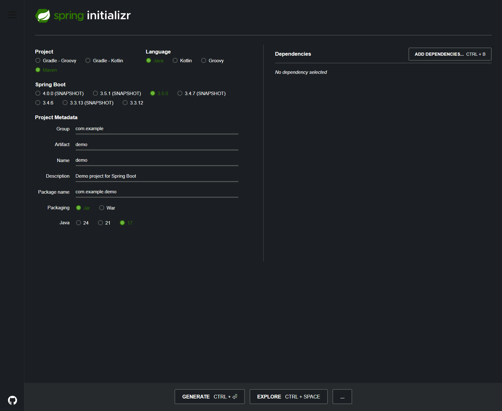
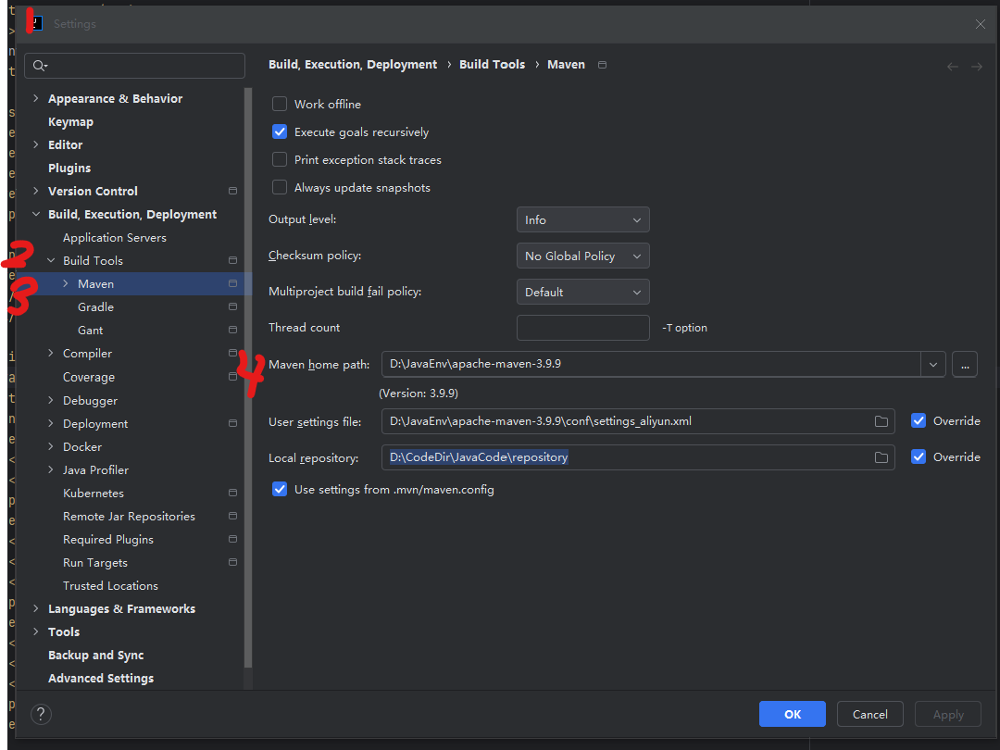
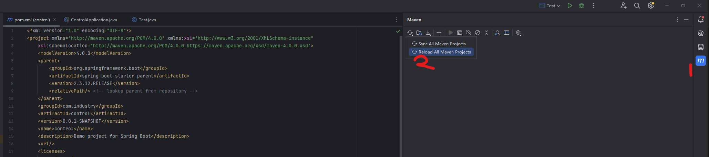
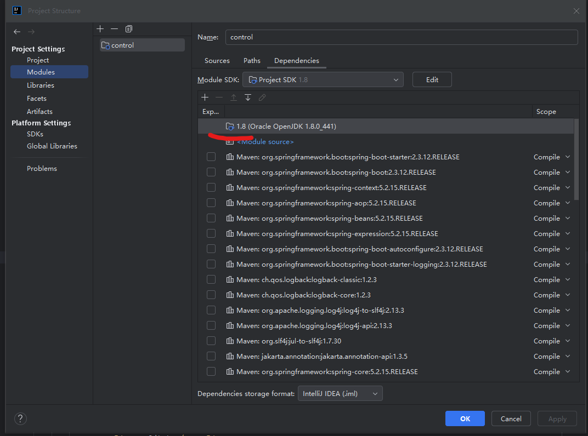
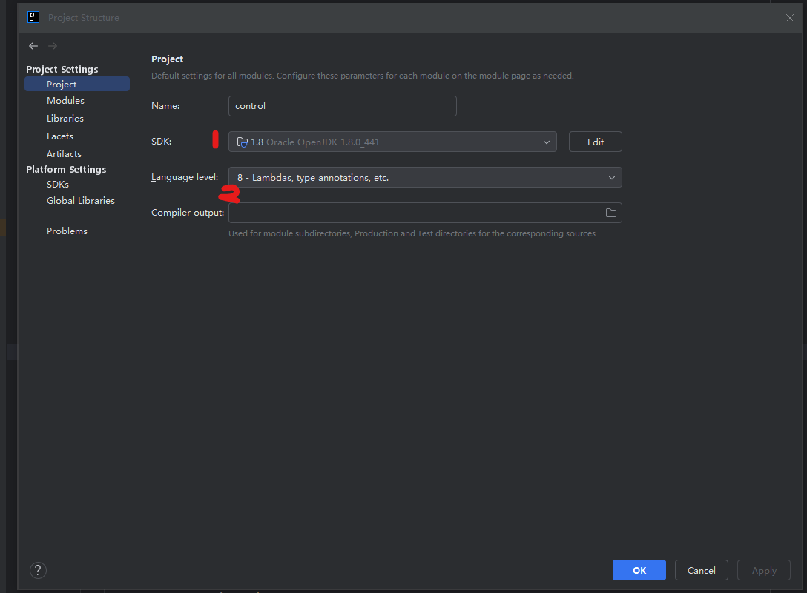

# 学习记录  

## **1. 使用 Spring Initializr（官方在线工具）**  
**步骤**：  
1. 访问 [start.spring.io](https://start.spring.io/)  
2. 配置项目参数：  
   - **Project**：选择构建工具（Maven 或 Gradle）  
   - **Language**：选择语言（Java、Kotlin 或 Groovy）  
   - **Spring Boot**：选择版本  
   - **Group & Artifact**：填写项目包名和名称  
   - **Dependencies**：添加所需依赖（如 Web、JPA、Security 等）  
3. 点击 **Generate** 下载压缩包  
4. 解压后导入 IDE（如 IntelliJ IDEA、Eclipse）  

  


## **2. 配置项目环境**  
在 IntelliJ IDEA 中配置 Maven 环境的步骤如下：  


### **步骤 1：确认本地 Maven 安装**  
1. **检查 Maven 是否安装**  
   打开终端（Windows 建议使用 PowerShell），执行命令：  
   ```bash  
   mvn -version  
   ```  
   - 若已安装，会显示 Maven 版本信息（如 `Apache Maven 3.8.6`）。  
   - 若未安装，需先下载并配置 Maven：  
     - 下载地址：[Maven 官网](https://maven.apache.org/download.cgi)  
     - 安装教程：[Maven 安装指南](https://maven.apache.org/install.html)  


### **步骤 2：配置 IDEA 中的 Maven**  
1. **打开 Settings/Preferences**  
   - **Windows/Linux**：`File` → `Settings`（快捷键 `Ctrl + Alt + S`）。  
   - **macOS**：`IntelliJ IDEA` → `Preferences`。  

2. **找到 Maven 配置项**  
   在左侧导航栏中依次选择：  
   `Build, Execution, Deployment` → `Build Tools` → `Maven`。  

3. **配置 Maven 路径**  
   在右侧面板中：  
   - **Maven home directory**：选择本地 Maven 安装路径（如 `D:\JavaEnv\apache-maven-3.9.9`）。  
   - **User settings file**：指向 Maven 的 `settings.xml` 文件（默认在 `Maven安装目录/conf/settings.xml`，如 `D:\JavaEnv\apache-maven-3.9.9\conf\settings_aliyun.xml`）。  
   - **Local repository**：指定本地仓库路径（如 `D:\CodeDir\JavaCode\repository`）。  

  


### **步骤 3：验证配置**  
1. **创建/打开 Maven 项目**  
   - 若为新项目：`File` → `New` → `Project` → 选择 `Maven` 并勾选 `Create from archetype`。  
   - 若为现有项目：直接打开 `pom.xml` 文件。  

2. **刷新 Maven 项目**  
   点击右侧工具栏中的 **Maven** 图标，在弹出的面板中点击 **Reload All Maven Projects**（刷新按钮）。  

  


### **步骤 4：配置 JDK**  
若 Maven 项目使用特定 JDK 版本：  
1. 打开 `Project Structure`（`File` → `Project Structure` 或 `Ctrl + Alt + Shift + S`）。  
2. 在 `Project Settings` → `Project` 中：  
   - **Project SDK**：选择项目使用的 JDK 版本。  
   - **Project language level**：匹配代码语法版本。  

  
  


### **步骤 5：配置 pom.xml 文件**  
#### 修改父项目配置  
```xml  
<parent>  
    <groupId>org.springframework.boot</groupId>  
    <artifactId>spring-boot-starter-parent</artifactId>  
    <version>3.5.0</version>  
    <relativePath/> <!-- lookup parent from repository -->  
</parent>  
```  

#### 定义版本  
```xml  
<version>2.3.12.RELEASE</version>  
```  

#### 补充依赖  
在 `<dependencies>` 标签下添加：  
```xml  
<dependency>  
    <groupId>com.alibaba</groupId>  
    <artifactId>QLExpress</artifactId>  
    <version>3.3.4</version>  
</dependency>  
```  
加载依赖
  


### **步骤 6：创建第一个官方示例**  
在 `src/main/java/com.industry.control` 目录下创建 `Test.java` 文件：  
```java  
package com.industry.control;  

import com.ql.util.express.DefaultContext;  
import com.ql.util.express.ExpressRunner;  

public class Test {  
    public static void main(String[] args) throws Exception {  
        ExpressRunner runner = new ExpressRunner();  
        DefaultContext<String, Object> context = new DefaultContext<String, Object>();  
        context.put("a", 1);  
        context.put("b", 2);  
        context.put("c", 3);  
        String express = "a + b * c";  
        Object r = runner.execute(express, context, null, true, false);  
        System.out.println(r);  
    }  
}  
```  


### 附录  
`control` 是一个基于 **Spring Initializr** 在线创建的 Spring Boot 项目。  


**说明**：  
- **Spring Initializr**：Spring 官方提供的快速初始化项目工具，支持通过 Web 界面配置项目依赖、语言、版本等参数，生成标准的 Spring Boot 项目结构。  
- **项目特点**：基于 Spring Boot 规范，包含基础的 Maven/Gradle 配置、启动类、资源目录等，可快速扩展业务代码。  

如需进一步了解项目配置或依赖详情，可参考生成的 `pom.xml`（或 `build.gradle`）文件及启动类 `ControlApplication.java`。